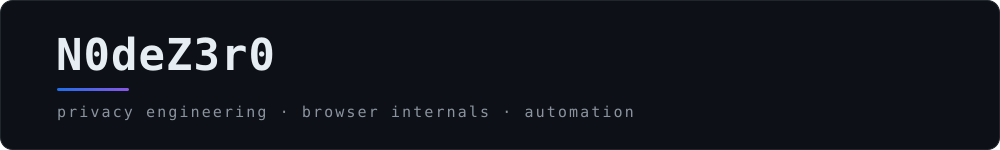

<picture>
  <source media="(prefers-color-scheme: light)" srcset="assets/banner-light.svg" />
  
</picture>

[English](README.md) · **Русский**

## О себе

Занимаюсь теми частями веба, которые опознают вас, не спрашивая, — canvas, WebGL,
метрики шрифтов, часовой пояс, геометрия экрана, — и тем, чтобы они сообщали
что-то другое, причём согласованно, выдерживая перекрёстную проверку. Подмена,
которая противоречит сама себе, хуже, чем её отсутствие: она делает вас
*более* приметным, а не менее.

**Устойчивость к отпечатку.** Согласованные профили вместо разрозненных
переопределений `navigator`. Проверено на CreepJS, BrowserLeaks, Pixelscan и
AmIUnique.

**Патченый Chromium и расширения.** Когда флага недостаточно, в дело идёт серия
патчей. Manifest V3, ядра на WebAssembly, внедрение в isolated и main world.

**Инструменты приватности для Windows.** C# и PowerShell. Телеметрия выключена —
и остаётся выключенной после следующего крупного обновления, потому что кто-то
должен за этим следить.

**Автоматизация.** Отклики на вакансии, замеры задержки и те браузерные
сценарии, которые стоит записать один раз.

В каждом репозитории ниже есть CI, политика безопасности, шаблоны задач и
документация на двух языках.

## Стек

<table>
<tr><td><b>Языки</b></td><td>JavaScript · TypeScript · C# · C++ · Python</td></tr>
<tr><td><b>Среда и сборка</b></td><td>WebAssembly · Node.js · .NET Framework 4.8 · PowerShell · Bash</td></tr>
<tr><td><b>Цели</b></td><td>Chromium · расширения Chrome (Manifest V3) · Windows 10 и 11</td></tr>
<tr><td><b>Инструменты</b></td><td>Git · GitHub Actions · Visual Studio · VS Code</td></tr>
</table>

## Избранное

<!-- projects:start -->
<table>
<tr>
<td width="50%" valign="top">

#### [fingerprint-shield](https://github.com/N0deZ3r0/fingerprint-shield)

Одна согласованная выдуманная машина — та же самая в окне, в каждом фрейме и в
каждом воркере. Заявка, которую раскладка может опровергнуть, собирает машину,
которой не бывает, а такая встречается реже исходной. 40 сьютов и раздел
«Пределы» с шестнадцатью пунктами, которые заведомо не закрыты.

</td>
<td width="50%" valign="top">

#### [Win11Privacy](https://github.com/N0deZ3r0/Win11Privacy)

Отключает сбор данных Microsoft, показывает, что об этой машине уже собрано, и
продолжает проверять систему по расписанию — потому что крупные обновления тихо
возвращают выключенное.

</td>
</tr>
<tr>
<td width="50%" valign="top">

#### [hh-ru-job-automation-bot](https://github.com/N0deZ3r0/hh-ru-job-automation-bot)

Откликается на вакансии hh.ru за пятью рубежами обороны — 26 функций
WebAssembly, 32 заблокированных трекера, 11 перехваченных API, — чтобы сайт не
мог опознать машину, которая это делает.

</td>
<td width="50%" valign="top">

#### [AutoSend-Letters-HH.RU](https://github.com/N0deZ3r0/AutoSend-Letters-HH.RU)

То же самое без расширения: один внедряемый скрипт, который проверяет, куда вы
уже откликнулись, заполняет сопроводительное письмо и листает страницы.

</td>
</tr>
<tr>
<td width="50%" valign="top">

#### [Quick-Ping-Chrome-Extension](https://github.com/N0deZ3r0/Quick-Ping-Chrome-Extension)

Время отклика любого сайта прямо из панели Chrome. Ввели адрес — получили
миллисекунды. Без регистрации, без настройки, и `ERROR` вместо выдуманного
числа, когда узел недоступен.

</td>
<td width="50%" valign="top">

#### [X-ray-for-web](https://github.com/N0deZ3r0/X-ray-for-web)

Chrome MV3 instrument, not a blocker: a journal of which script read which
fingerprinting surface, and outgoing beacons parsed field by field — "this is a
hash of your email" instead of base64

</td>
</tr>
</table>
<!-- projects:end -->

## Активность

<picture>
  <source media="(prefers-color-scheme: light)" srcset="https://raw.githubusercontent.com/N0deZ3r0/N0deZ3r0/main/assets/overview-light.svg" />
  
</picture>

 

<picture>
  <source media="(prefers-color-scheme: light)" srcset="https://raw.githubusercontent.com/N0deZ3r0/N0deZ3r0/main/assets/insight-light.svg" />
  
</picture>

 

<picture>
  <source media="(prefers-color-scheme: light)" srcset="https://raw.githubusercontent.com/N0deZ3r0/N0deZ3r0/main/assets/streak-light.svg" />
  
</picture>

 

<picture>
  <source media="(prefers-color-scheme: light)" srcset="https://raw.githubusercontent.com/N0deZ3r0/N0deZ3r0/main/assets/pacman-light.svg" />
  
</picture>

---

Приватность — это не галочка. Это статья инженерного бюджета.

